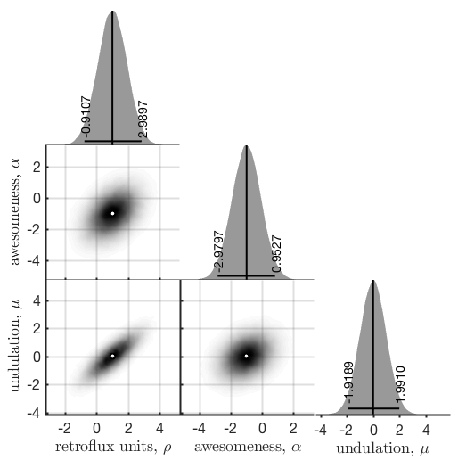

# mcmc-utils-matlab
A set of handy utilities and plotting functions for dealing with MCMC in Matlab. This package is under development. Feel very free to submit Issues for bug reports and feature requests. Also see the Issues for upcoming fixes and new features.

## Importing the package

Make sure to set the `pathOfPackage` NOT to the `+mcmc` package itself, but it's parent folder.

````matlab
pathToPackage = '~/git-local/mcmc-utils-matlab';
addpath(genpath(pathToPackage))
````

One of the first things to do is to call `mcmc.setPlotTheme`, which will change default Matlab plot options to something a bit more stylish. You can just call `mcmc.setPlotTheme()` without any options, to use defaults, or you can supply name-value pairs, such as:


````matlab
mcmc.setPlotTheme('fontsize',16, 'linewidth',2)
````

In practice you will be providing your own MCMC samples, but the code below will generate artificial data. You can also provide a cell array of strings (here `variableNames`) which will be used in the plotting. Note that you can use LaTeX format as well.

````matlab
%% generate faux mcmc data
mu = [1 -1]; Sigma = [.9 .4; .4 .3];
samples = mvnrnd(mu, Sigma, 10^5);
%plot(samples(:,1),samples(:,2),'.');
variableNames={'retroflux units, $\rho$','awesomeness, $\alpha$'};
````

## `UnivariateDistribution` class

A `UnivariateDistribution` object provides basic plotting and summary statistics.

````matlab
figure(1), clf

subplot(1,2,1)
uni = mcmc.UnivariateDistribution(samples(:,1),...
	'xLabel', variableNames{1});
title('plotstyle=''density''')

subplot(1,2,2)
uni2 = mcmc.UnivariateDistribution(samples(:,2),...
	'xLabel', variableNames{2},...
	'plotStyle','hist');
title('plotstyle=''hist''')
````


## `BivariateDistribution` class

A `BivariateDistribution` object also provides some plotting capabilities and calculates mean, median, and mode.

```matlab
figure(2), clf
subplot(1,3,1)
bi1 = mcmc.BivariateDistribution(samples(:,1),samples(:,2),...
	'xLabel',variableNames{1},...
	'yLabel',variableNames{2});
title('plotstyle=''density''')

subplot(1,3,2)
bi2 = mcmc.BivariateDistribution(samples(:,1),samples(:,2),...
	'xLabel',variableNames{1},...
	'yLabel',variableNames{2},...
	'plotStyle','hist');
title('plotstyle=''hist''')
tempAxisLims = axis;

subplot(1,3,3)
bi3 = mcmc.BivariateDistribution(samples(:,1),samples(:,2),...
	'xLabel',variableNames{1},...
	'yLabel',variableNames{2},...
	'plotStyle','contour',...
	'probMass',0.5);
title('plotstyle=''contour''')
axis(tempAxisLims)
```


## `TriPlotSamples` class
We can get a handy plot of all the univariate distributions, and all pairwise joint marginal distributions by using the `TriPlotSamples` class.

```matlab
figure(3), clf
tri = mcmc.TriPlotSamples(samples,...
	variableNames,...
	'figSize', 15);
```


